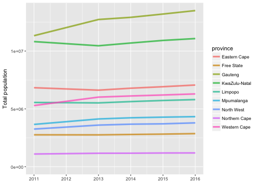

<!-- README.md is generated from README.Rmd. Please edit that file -->

southafricastats: Population and Mortality Statistics for South Africa
------------------------------------

**Author:** [Julia Silge](http://juliasilge.com/)<br/>
**License:** [MIT](https://opensource.org/licenses/MIT)

[](https://travis-ci.org/juliasilge/southafricastats)


This package provides a small excerpt of the data available at the [South Africa Data Portal](http://southafrica.opendataforafrica.org/). For each of the nine provinces in South Africa, this package provides mortality numbers from several causes from 2008 to 2013 and total population from 2011 to 2016. This package was built to support my introductory Shiny workshop at the February 2017 [satRday conference in Cape Town, South Africa](http://satrdays.org/capetown2017/).

### Installation

You can install this package from Github with [devtools](https://github.com/hadley/devtools):


```r
library(devtools)
install_github("juliasilge/southafricastats")
```


### Working with the datasets

There are two datasets in this package. The first one, `population`, contains total population counts for the nine provinces in South Africa for the years 2011 to 2016.


```r
library(ggplot2)

ggplot(population, aes(year, total, color = province)) + 
    geom_line(size = 1.5, alpha = 0.7) +
    labs(x = NULL, y = "Total population")
```



The second dataset, `mortality`, contains number of deaths due to various causes in the nine provinces for the years 2008 to 2013. What are the most common causes of death in these provinces?


```r
mortality %>%
    count(indicator, sort = TRUE)
#> # A tibble: 18 × 2
#>                                                              indicator
#>                                                                  <chr>
#> 1                                                           All causes
#> 2                                   Cerebrovascular diseases (I60-I69)
#> 3                                          Diabetes mellitus (E10-E14)
#> 4                                      Hypertensive diseases (I10-I15)
#> 5                                                   Non-natural causes
#> 6                               Other forms of heart disease (I30-I52)
#> 7                                                 Other natural causes
#> 8                                               Tuberculosis (A15-A19)
#> 9                                    Influenza and pneumonia (J10-J18)
#> 10                Human immunodeficiency virus [HIV] disease (B20-B24)
#> 11                            Intestinal infectious diseases (A00-A09)
#> 12                        Chronic lower respiratory diseases (J40-J47)
#> 13          Certain disorders involving the immune mechanism (D80-D89)
#> 14                                      Other viral diseases (B25-B34)
#> 15                                  Ischaemic heart diseases (I20-I25)
#> 16                    Malignant neoplasm of digestive organs (C15-C26)
#> 17 Malignant neoplasm of respiratory and intrathoracic organs (C30-39)
#> 18       Inflammatory diseases of the central nervous system (G00-G09)
#> # ... with 1 more variables: n <int>
```

How has the number of HIV deaths in Gauteng, KwaZulu-Natal, and Eastern Cape changed over time?


```r
mortality %>%
    filter(indicator == "Human immunodeficiency virus [HIV] disease (B20-B24)",
           province %in% c("Gauteng", "KwaZulu-Natal", "Eastern Cape")) %>%
    ggplot(aes(year, deaths, color = province)) +
    geom_line(size = 1.5, alpha = 0.7) +
    labs(x = NULL, y = "Number of deaths")
```


Please note that this project is released with a [Contributor Code of Conduct](CONDUCT.md). By participating in this project you agree to abide by its terms.
